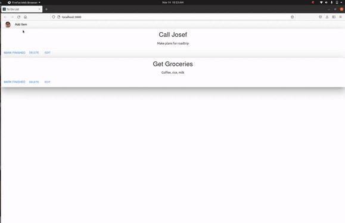

# To Do App
Simple browser app for managing my to do list

# Results
Below is a gif of myself using the app <br />


# System Setup
To start everything, run ```sudo bash launch.sh```

### Starting the Database
I put the database in a Docker container. To start it, run 
``` 
cd server
sudo docker-compose up
```

### Start the Server
I used Express to make a REST API. To start the server, run
```
cd server 
node app.js
```

### Deploy the React App
I used React to make the frontend. To start the React development server, run
```
cd to_do/src
npm start
``` 


